# Software Requirements Specification
# Autonomous Emergency Braking (AEB) System

**Stellantis Technological Residency - Embedded Software Development for the Automotive Sector**

| Field | Value |
|-------|-------|
| **Document Version** | 2.0 |
| **Date** | 2026-02-26 |
| **Status** | Draft - Pending Stellantis Approval |
| **Classification** | Academic Project |
| **Standard** | Based on IEEE 830 / ISO 29148 |

### Authors

| Name |
|------|
| Jessica Roberta de Souza Santos |
| Eryca Francyele de Moura e Silva |
| Lourenço Jamba Mphili |
| Rian Ithalo da Costa Linhares |
| Renato Silva Fagundes |

### Revision History

| Version | Date | Author | Description |
|---------|------|--------|-------------|
| 1.0 | 2026-02-25 | Project Team | Initial draft in Portuguese |
| 2.0 | 2026-02-26 | Project Team | English version with UML diagrams, improved structure per IEEE 830 |

---

## Table of Contents

1. [Introduction](#1-introduction)
2. [System Overview](#2-system-overview)
3. [UML System Modeling](#3-uml-system-modeling)
4. [Functional Requirements](#4-functional-requirements)
5. [Non-Functional Requirements](#5-non-functional-requirements)
6. [Architecture and Implementation Split](#6-architecture-and-implementation-split)
7. [Test Scenarios](#7-test-scenarios)
8. [Risk Analysis](#8-risk-analysis)
9. [Traceability Matrix](#9-traceability-matrix)
10. [Project Schedule](#10-project-schedule)
11. [Curriculum Mapping](#11-curriculum-mapping)
12. [Open Decisions](#12-open-decisions)
13. [References](#13-references)

---

## 1. Introduction

### 1.1 Purpose

This document specifies the software requirements for an Autonomous Emergency Braking (AEB) system developed as a capstone project for the Technological Residency in Embedded Software Development for the Automotive Sector, sponsored by Stellantis. It follows the IEEE 830 / ISO 29148 recommended structure for Software Requirements Specifications.

### 1.2 Scope

The AEB system covers rear-end collision detection and mitigation between an ego vehicle (VUT - Vehicle Under Test) and a target vehicle (VT - Vehicle Target), with **longitudinal-only** actuation (no lateral control), operating in the **urban speed range (10-80 km/h)**.

The project covers three primary scenarios aligned with Euro NCAP and UNECE R152 protocols:
- **CCRs** - Car-to-Car Rear Stationary (stationary target)
- **CCRm** - Car-to-Car Rear Moving (slower moving target)
- **CCRb** - Car-to-Car Rear Braking (decelerating target)

### 1.3 Definitions, Acronyms, and Abbreviations

| Term | Definition |
|------|-----------|
| **AEB** | Autonomous Emergency Braking |
| **ADAS** | Advanced Driver Assistance Systems |
| **ASIL** | Automotive Safety Integrity Level (ISO 26262) |
| **CCRs/CCRm/CCRb** | Car-to-Car Rear Stationary/Moving/Braking (Euro NCAP test scenarios) |
| **ECU** | Electronic Control Unit |
| **FSM** | Finite State Machine |
| **HARA** | Hazard Analysis and Risk Assessment |
| **HIL** | Hardware-in-the-Loop |
| **MIL** | Model-in-the-Loop |
| **MISRA** | Motor Industry Software Reliability Association |
| **PID** | Proportional-Integral-Derivative controller |
| **SIL** | Software-in-the-Loop |
| **TTC** | Time-to-Collision |
| **VUT** | Vehicle Under Test (ego vehicle) |
| **VT** | Vehicle Target |
| **WCET** | Worst-Case Execution Time |

### 1.4 Assumptions and Constraints

**Assumptions:**
1. Sensor data is provided by simulation (Gazebo or Simulink plant model), not real hardware.
2. The perception layer delivers pre-processed distance and velocity values (no raw image/point-cloud processing).
3. The road surface is dry (friction coefficient mu = 0.8) for baseline scenarios.
4. Only one target vehicle is considered at a time (no multi-object tracking).

**Constraints:**
1. **Timeline:** 8 weeks from requirements to final delivery.
2. **Tooling:** MATLAB/Simulink (with Stateflow and Embedded Coder), Gazebo, ROS 2, GCC for C compilation.
3. **Focus:** The primary deliverable is the embedded C software; Simulink modeling and Gazebo simulation are supporting activities.
4. **No real hardware:** All testing is virtual (MIL, SIL, simulated environment).

### 1.5 Applicable Standards

| Standard | Description | Application |
|----------|-----------|-------------|
| **ISO 26262** | Functional safety for road vehicles | ASIL classification, V-model process |
| **UNECE R152** | Advanced Emergency Braking Systems regulation | Minimum performance requirements |
| **Euro NCAP AEB** | AEB test protocols | Validation scenarios |
| **ISO 15622** | ACC performance requirements | Longitudinal control reference |
| **ISO 22839** | Forward vehicle collision mitigation | AEB functional requirements |
| **MISRA C:2012** | C coding guidelines for safety-critical systems | Embedded code quality |
| **GB/T 33577-2017** | Chinese AEB standard (referenced in MDPI article) | TTC threshold reference |

---

## 2. System Overview

### 2.1 Three-Layer Architecture

The system follows the classical three-layer ADAS architecture:

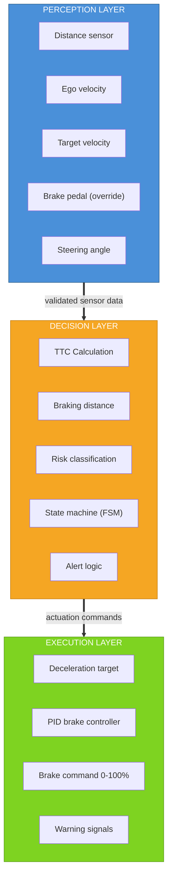

> **Note:** In this academic project, the perception layer is **simulated** (data from Gazebo or Simulink models). However, the software architecture must respect the logical separation between layers as if it were a production system.

### 2.2 Intervention Levels

The AEB system operates in progressive intervention levels based on Time-to-Collision:

| Level | TTC Range | Action | Deceleration |
|-------|----------|--------|-------------|
| **STANDBY** | TTC > 4.0 s | No action | 0 m/s^2 |
| **WARNING** | 4.0 s >= TTC > 3.0 s | Audio + visual alert | 0 m/s^2 |
| **BRAKE_L1** | 3.0 s >= TTC > 2.25 s | Light pre-braking | -2 m/s^2 |
| **BRAKE_L2** | 2.25 s >= TTC > 1.75 s | Partial braking | -4 m/s^2 |
| **BRAKE_L3** | TTC <= 1.75 s | Full emergency braking | -6 m/s^2 |

> **Alternative (simplified):** 2 levels - PARTIAL_BRAKE (-3.5 m/s^2, TTC 2.0-1.2s) and FULL_BRAKE (-6 m/s^2, TTC <= 1.2s). Use if schedule requires simplification.

---

## 3. UML System Modeling

### 3.1 Use Case Diagram

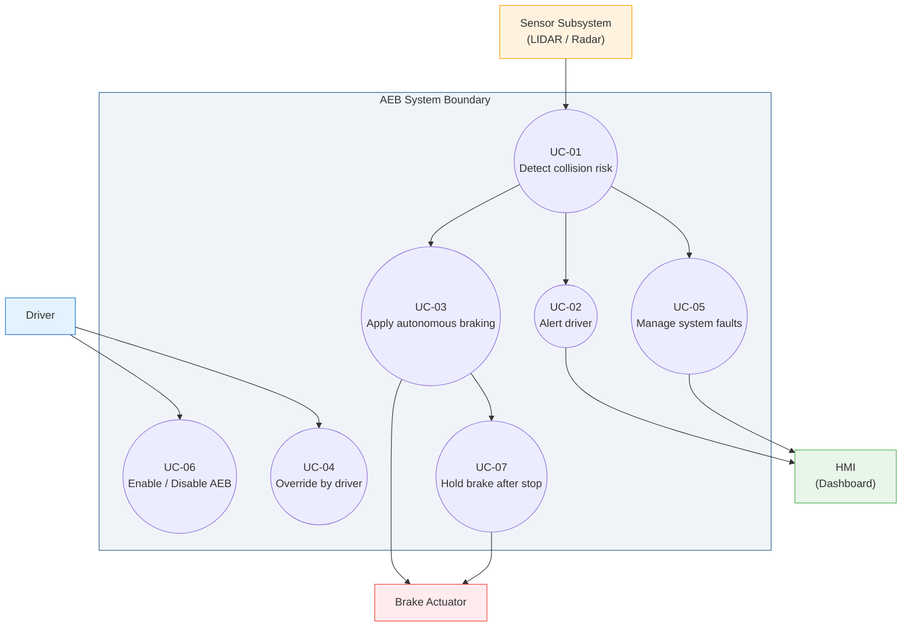

**Use Case Descriptions:**

| ID | Use Case | Primary Actor | Description |
|----|----------|--------------|-------------|
| UC-01 | Detect collision risk | Sensor Subsystem | System calculates TTC and braking distance every 10ms cycle |
| UC-02 | Alert driver | System | Emits visual and audible warning when TTC enters warning zone |
| UC-03 | Apply autonomous braking | System | Applies progressive deceleration based on risk level |
| UC-04 | Override by driver | Driver | Driver takes control via brake pedal or steering; system deactivates |
| UC-05 | Manage system faults | System | Detects sensor failures, transitions to safe state (OFF) |
| UC-06 | Enable/Disable AEB | Driver | Driver can toggle AEB on/off via dashboard button |
| UC-07 | Hold brake after stop | System | Maintains brake pressure for 2s after vehicle comes to full stop |

### 3.2 Class Diagram (C Modules Structure)

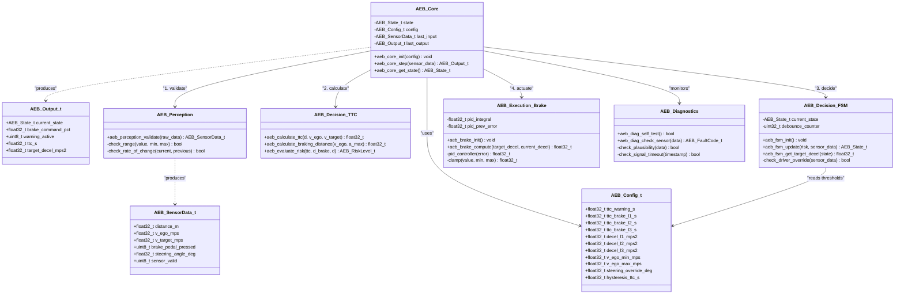

### 3.3 State Machine Diagram

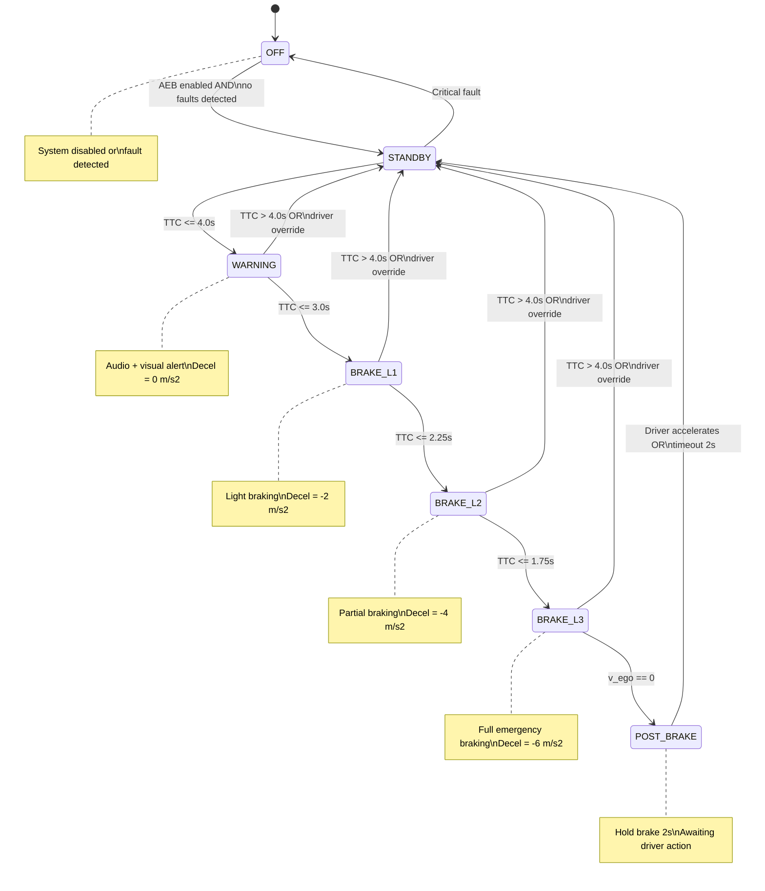

> **Transitions to OFF:** Every state can transition to OFF on critical fault detection (fail-safe). Escalation to more critical levels is immediate; de-escalation has a 200ms debounce.

### 3.4 Sequence Diagram (10ms Execution Cycle)

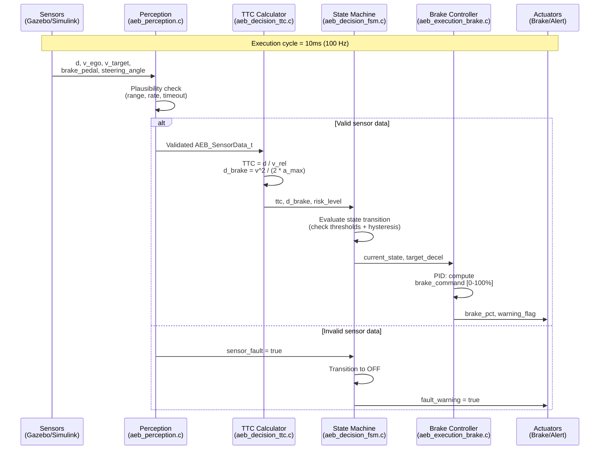

### 3.5 Component Diagram (Software Architecture)

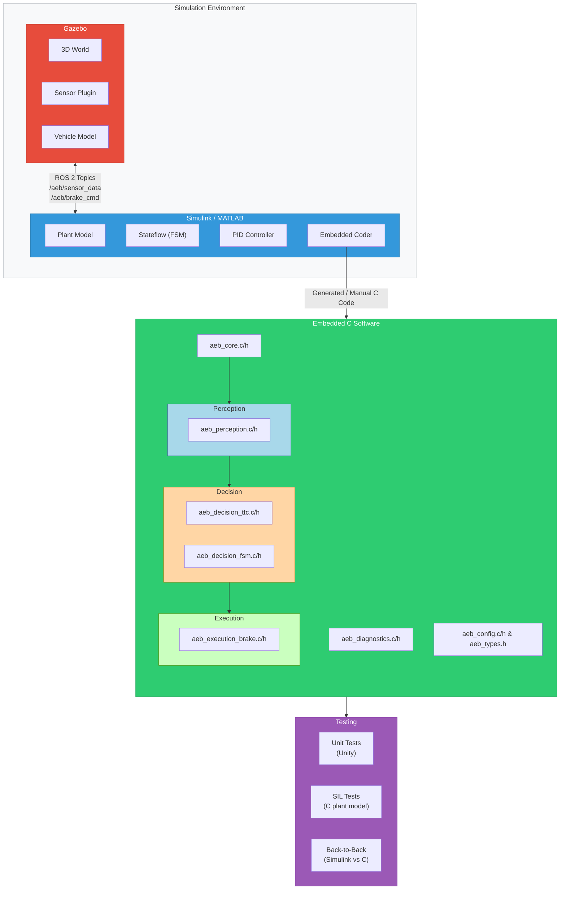

### 3.6 Activity Diagram (AEB Decision Flow)

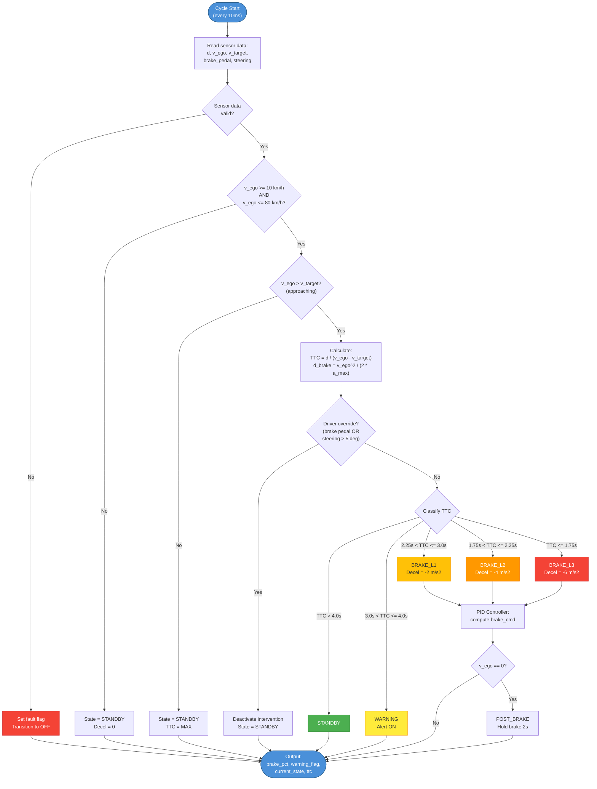

### 3.7 Deployment Diagram

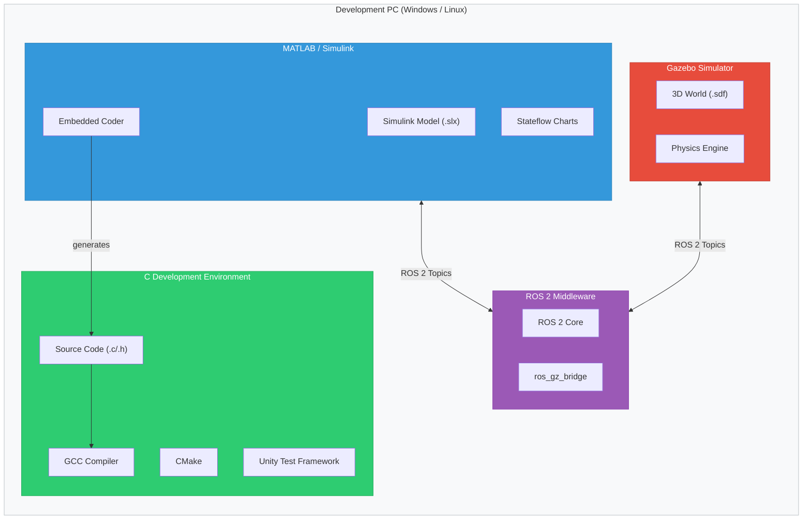

---

## 4. Functional Requirements

### 4.1 Perception and Data Acquisition

| ID | Requirement | Priority | Acceptance Criteria | Trace |
|----|------------|----------|-------------------|-------|
| **FR-PER-001** | The system shall acquire the relative distance (d) between ego and target vehicles every execution cycle. | Essential | Distance value updated every 10ms within [0, 300] m range. | ISO 22839 |
| **FR-PER-002** | The system shall acquire ego vehicle velocity (v_ego) every execution cycle. | Essential | Velocity value updated every 10ms within [0, 50] m/s range. | UNECE R152 |
| **FR-PER-003** | The system shall acquire target vehicle velocity (v_target) or compute relative velocity (v_rel = v_ego - v_target). | Essential | Relative velocity computed with resolution <= 0.1 m/s. | ISO 22839 |
| **FR-PER-004** | The system shall detect whether the brake pedal is pressed by the driver (driver override). | Essential | Binary signal (pressed/released) updated every cycle. | UNECE R152 Art.6 |
| **FR-PER-005** | The system shall detect steering wheel angle to identify evasive maneuvers by the driver. | Desirable | Angle value with resolution <= 1 degree. | Euro NCAP |
| **FR-PER-006** | The system shall validate sensor data coherence before using it in the decision logic (plausibility check). | Essential | Out-of-range values rejected; rate-of-change validated. | ISO 26262 |
| **FR-PER-007** | The system shall detect signal loss or out-of-range data and set an internal fault flag. | Essential | Fault detected within 3 cycles (30ms) of invalid data. | ISO 26262 |

### 4.2 Decision Logic and Risk Calculation

| ID | Requirement | Priority | Acceptance Criteria | Trace |
|----|------------|----------|-------------------|-------|
| **FR-DEC-001** | The system shall compute Time-to-Collision as `TTC = d / (v_ego - v_target)`, valid when `v_ego > v_target`. | Essential | TTC accuracy within 0.05s of ground truth in SIL. | MDPI Art., ISO 22839 |
| **FR-DEC-002** | The system shall compute minimum braking distance as `d_brake = v_ego^2 / (2 * a_max)`. | Essential | d_brake matches analytical value within 0.5m. | Complements TTC |
| **FR-DEC-003** | The system shall use **both** TTC and minimum braking distance as decision criteria (dual-criteria). | Recommended | System brakes if either criterion is met. | Robustness |
| **FR-DEC-004** | The system shall classify the intervention state into progressive levels based on TTC (see Section 2.2). | Essential | State transitions match TTC thresholds in all test scenarios. | MDPI Art., GB/T 33577 |
| **FR-DEC-005** | The system should support adaptive TTC thresholds as a function of ego velocity. Higher speeds should use more conservative (larger) TTC thresholds. | Desirable | Configurable threshold table per velocity bracket. | Adaptive AEB |
| **FR-DEC-006** | The system shall deactivate intervention if the driver initiates braking (brake pedal override). | Essential | Autonomous braking ceases within 1 cycle after brake pedal detected. | UNECE R152 |
| **FR-DEC-007** | The system shall deactivate intervention if an evasive steering maneuver is detected (steering angle > 5 degrees). | Desirable | Intervention ceases within 1 cycle after override detected. | Euro NCAP |
| **FR-DEC-008** | The system shall only be active when `v_ego >= 10 km/h` AND `v_ego <= 80 km/h`. | Essential | System remains in STANDBY outside this range. | UNECE R152 |
| **FR-DEC-009** | TTC shall only be computed when relative velocity is positive (ego approaching target). Otherwise, the system shall remain in STANDBY. | Essential | No false activations when vehicles are diverging. | Basic logic |
| **FR-DEC-010** | The system shall implement hysteresis on state transitions to prevent oscillation (chattering). | Essential | No state oscillation in any test scenario. Hysteresis >= 0.2s. | Control best practice |

### 4.3 Driver Alert

| ID | Requirement | Priority | Acceptance Criteria | Trace |
|----|------------|----------|-------------------|-------|
| **FR-ALR-001** | The system shall emit a visual alert (dashboard indicator) when entering WARNING state. | Essential | Visual flag set within 1 cycle of WARNING entry. | UNECE R152 |
| **FR-ALR-002** | The system shall emit an audible alert (buzzer/beep) when entering WARNING state. | Essential | Audio flag set within 1 cycle of WARNING entry. | UNECE R152 |
| **FR-ALR-003** | The alert shall precede any autonomous braking intervention by at least 0.8 seconds. | Essential | Time delta between WARNING entry and BRAKE_L1 entry >= 800ms in all scenarios. | UNECE R152 Art.4 |
| **FR-ALR-004** | The alert shall cease when the system returns to STANDBY or the driver assumes control. | Essential | Alert flags cleared within 1 cycle of state change. | Usability |

### 4.4 Brake Control (Execution)

| ID | Requirement | Priority | Acceptance Criteria | Trace |
|----|------------|----------|-------------------|-------|
| **FR-BRK-001** | The system shall apply progressive deceleration according to risk level (smooth transition between levels). | Essential | No abrupt deceleration jumps > 2 m/s^2 between cycles. | Comfort/safety |
| **FR-BRK-002** | The system shall use a PID controller (or equivalent) to achieve the target deceleration for each level. | Essential | Steady-state deceleration error < 0.5 m/s^2 within 500ms. | MDPI Art. |
| **FR-BRK-003** | Maximum deceleration applied by the system shall be limited to -6 m/s^2 (~0.6g). | Essential | Brake command never produces deceleration exceeding 6.5 m/s^2. | UNECE R152 |
| **FR-BRK-004** | Longitudinal jerk (derivative of acceleration) shall be limited to `|jerk| <= 10 m/s^3`. | Desirable | Measured jerk within limit in all scenarios. | Drivability |
| **FR-BRK-005** | After full vehicle stop (v_ego = 0), the system shall maintain braking for at least 2 seconds (hold brake). | Essential | Brake command > 50% for 2s after stop. | Post-stop safety |
| **FR-BRK-006** | The system shall release autonomous braking immediately when the driver presses the accelerator after a complete stop. | Essential | Brake released within 1 cycle of accelerator input. | UNECE R152 |
| **FR-BRK-007** | The brake command output shall be a percentage value [0-100%] mapped to brake system pressure. | Essential | Output clamped to [0, 100] range in all conditions. | Actuator interface |

### 4.5 State Machine

| ID | Requirement | Priority | Acceptance Criteria | Trace |
|----|------------|----------|-------------------|-------|
| **FR-FSM-001** | The system shall be modeled as a finite state machine with states: OFF, STANDBY, WARNING, BRAKE_L1, BRAKE_L2, BRAKE_L3, POST_BRAKE. | Essential | All 7 states reachable in test scenarios. | Stateflow |
| **FR-FSM-002** | The OFF state shall represent system disabled (AEB button off or fault detected). | Essential | System outputs zero brake command in OFF state. | Safety |
| **FR-FSM-003** | POST_BRAKE state shall activate after full stop, maintaining residual braking and awaiting driver action. | Essential | POST_BRAKE entered only when v_ego reaches 0. | Safety |
| **FR-FSM-004** | Escalation to more critical levels shall be immediate; de-escalation shall have a minimum 200ms debounce. | Essential | Measured in SIL: escalation < 10ms, de-escalation >= 200ms. | Anti-chattering |
| **FR-FSM-005** | Any state shall allow transition to OFF on critical fault detection (fail-safe). | Essential | OFF reached within 1 cycle of any fault from any state. | ISO 26262 |

### 4.6 Code Generation and Traceability

| ID | Requirement | Priority | Acceptance Criteria | Trace |
|----|------------|----------|-------------------|-------|
| **FR-COD-001** | The Simulink/Stateflow model shall be capable of generating embedded C code via Embedded Coder. | Essential | Code compiles with GCC without errors or warnings. | Modeling course |
| **FR-COD-002** | The C code (generated or manual) shall reproduce the Simulink model behavior with a maximum stopping distance tolerance of 2.0m. | Essential | Back-to-back test: |delta_d_stop| < 2.0m for all scenarios. | MDPI Art. (1.7m ref) |
| **FR-COD-003** | Bidirectional traceability shall exist between requirements, model blocks, and C functions. | Desirable | Traceability matrix maintained and reviewed. | ISO 26262 |

---

## 5. Non-Functional Requirements

### 5.1 Performance and Real-Time

| ID | Requirement | Value | Justification |
|----|------------|-------|---------------|
| **NFR-PERF-001** | AEB algorithm execution cycle | **10 ms** (100 Hz) | Typical ADAS safety-critical requirement. |
| **NFR-PERF-002** | Worst-Case Execution Time (WCET) | < **5 ms** | Must complete within half the cycle for safety margin. |
| **NFR-PERF-003** | Maximum sensor-to-actuator latency (end-to-end) | < **150 ms** | 150ms ~= 1.7m at 40 km/h. |
| **NFR-PERF-004** | Alert response time (sensor to visible alert) | < **200 ms** | Alert perceptibility. |
| **NFR-PERF-005** | Time between WARNING onset and autonomous braking | >= **800 ms** | UNECE R152 - driver reaction time. |

### 5.2 Functional Safety (ISO 26262)

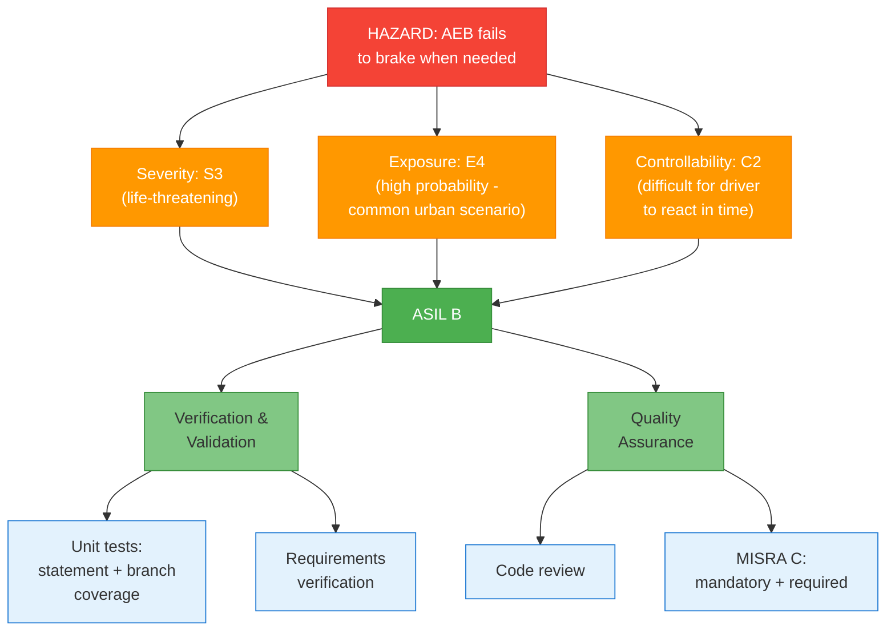

| ID | Requirement | Value | Justification |
|----|------------|-------|---------------|
| **NFR-SAF-001** | ASIL classification for the AEB system | **ASIL B** (minimum) | S3 x E4 x C2. Full braking path may reach ASIL D. |
| **NFR-SAF-002** | The system shall implement fail-safe mode: deactivate AEB and alert driver on fault. | Mandatory | ISO 26262: safe state = system off + notification. |
| **NFR-SAF-003** | Sensor failure shall not result in spurious braking (unintended activation). | Mandatory | Prevent secondary risk (rear-end collision from unexpected braking). |
| **NFR-SAF-004** | The system shall perform power-on self-test at initialization. | Desirable | ISO 26262 diagnostics. |
| **NFR-SAF-005** | Sensor fault detection shall occur within 3 execution cycles (30ms). | Recommended | Fast degradation response. |

> **ASIL Note:** Full HARA depends on formal analysis. For this academic project, **ASIL B** is the reference, requiring unit tests with statement/branch coverage, code review, requirements verification, and partial MISRA C compliance (mandatory + required rules).

### 5.3 Code Quality

| ID | Requirement | Value | Justification |
|----|------------|-------|---------------|
| **NFR-COD-001** | MISRA C:2012 compliance | **Mandatory** rules: 100%. **Required** rules: analysis and justification for deviations. | Automotive industry standard. |
| **NFR-COD-002** | No use of: `malloc`/`free`, recursion, dynamic function pointers. | Mandatory | MISRA C critical rules for embedded systems. |
| **NFR-COD-003** | All variables shall be initialized before use. | Mandatory | MISRA C Rule 9.1. |
| **NFR-COD-004** | No dead code or unused variables. | Mandatory | MISRA C Rule 2.2. |
| **NFR-COD-005** | Exclusive use of fixed-width types (`int8_t`, `uint16_t`, `float32_t`, etc.). | Recommended | Cross-platform portability. |
| **NFR-COD-006** | Unit test statement coverage >= 80%. | Recommended | ISO 26262 ASIL B. |
| **NFR-COD-007** | Unit test branch/decision coverage >= 60%. | Recommended | ISO 26262 ASIL B. |

### 5.4 Verification and Validation

| ID | Requirement | Acceptance Criteria |
|----|------------|-------------------|
| **NFR-VAL-001** | Validate AEB on **CCRs** scenario: ego at 40 km/h, target stationary. | Full stop OR residual velocity < 5 km/h. |
| **NFR-VAL-002** | Validate AEB on **CCRm** scenario: ego at 50 km/h, target at 20 km/h. | Collision avoided OR impact speed reduced by >= 20 km/h. |
| **NFR-VAL-003** | Validate AEB on **CCRb** scenario: ego at 50 km/h, target decelerating at -2 m/s^2. | Collision avoided OR impact speed < 15 km/h. |
| **NFR-VAL-004** | For each scenario, measure: final distance to impact, residual impact velocity, percentage velocity reduction. | All metrics recorded and reported. |
| **NFR-VAL-005** | SIL testing: C code executing against a plant model. | All 3 scenarios pass acceptance criteria. |
| **NFR-VAL-006** | Gazebo 3D simulation demonstration for at least 1 scenario (CCRs recommended). | Visual demonstration + logged data. |
| **NFR-VAL-007** | Back-to-back testing evidence: Simulink vs C code equivalence. | Stopping distance delta < 2.0m for all scenarios. |

### 5.5 Portability and Maintainability

| ID | Requirement | Description |
|----|------------|-----------|
| **NFR-POR-001** | The C code shall be platform-independent (no hardware-specific dependencies). Must compile with GCC and be testable on PC. | Portability |
| **NFR-POR-002** | Calibration parameters (TTC thresholds, deceleration values, etc.) shall be separated from code in a configuration structure. | Maintainability |
| **NFR-POR-003** | The code shall follow modular architecture with well-defined interfaces between layers (perception, decision, execution). | AUTOSAR-like |

---

## 6. Architecture and Implementation Split

### 6.1 What Goes Where

| Tool | Responsibility | Key Files/Artifacts |
|------|---------------|-------------------|
| **Simulink** | Plant model (vehicle dynamics), idealized sensor model, PID controller tuning, analysis scopes and plots | `.slx` model files, `.m` scenario scripts |
| **Stateflow** | AEB state machine design (7 states), transitions, guards, actions | Stateflow charts within `.slx` |
| **Embedded Coder** | Auto-generate C code from Simulink/Stateflow model | Generated `.c/.h` files |
| **Gazebo** | 3D world, vehicle physics, LIDAR sensor, ROS 2 topic publication, visualization | `.sdf/.world` files, sensor plugins |
| **ROS 2** | Communication bridge between Gazebo and Simulink/C code | Topic definitions, bridge config |
| **C Code (manual)** | Core AEB embedded software: FSM, TTC, brake control, diagnostics, config, types | `aeb_*.c/h` files |
| **C Testing** | Unit tests, SIL scenarios, back-to-back comparison | `test_*.c`, `sil_*.c` files |

### 6.2 C Project Structure

```
aeb_embedded/
|-- inc/
|   |-- aeb_types.h              # Types, enums, structs (AEB_State_t, AEB_SensorData_t, etc.)
|   |-- aeb_config.h             # Calibration parameters (TTC thresholds, decel values)
|   |-- aeb_perception.h         # Perception layer interface
|   |-- aeb_decision_ttc.h       # TTC + braking distance calculation interface
|   |-- aeb_decision_fsm.h       # State machine interface
|   |-- aeb_execution_brake.h    # Brake controller interface
|   |-- aeb_core.h               # Main cyclic function interface
|   |-- aeb_diagnostics.h        # Self-test and fault detection interface
|
|-- src/
|   |-- aeb_perception.c         # Sensor validation (range, rate-of-change, timeout)
|   |-- aeb_decision_ttc.c       # TTC and braking distance computation
|   |-- aeb_decision_fsm.c       # State machine (can be Stateflow-generated or manual)
|   |-- aeb_execution_brake.c    # PID brake controller
|   |-- aeb_core.c               # Main loop: perception -> decision -> execution
|   |-- aeb_diagnostics.c        # Plausibility checks, power-on self-test
|   |-- aeb_config.c             # Default parameter values
|
|-- test/
|   |-- test_aeb_ttc.c           # TTC calculation unit tests
|   |-- test_aeb_fsm.c           # State machine unit tests
|   |-- test_aeb_brake.c         # Brake controller unit tests
|   |-- test_aeb_perception.c    # Sensor validation unit tests
|   |-- test_aeb_integration.c   # Integration tests (CCRs, CCRm, CCRb)
|   |-- test_runner.c            # Test runner main
|
|-- sil/
|   |-- sil_main.c               # SIL runner: C code vs plant model
|   |-- sil_plant_model.c        # Simplified plant model in C
|   |-- sil_scenario_ccrs.c      # CCRs scenario setup
|   |-- sil_scenario_ccrm.c      # CCRm scenario setup
|   |-- sil_scenario_ccrb.c      # CCRb scenario setup
|
|-- CMakeLists.txt
```

### 6.3 Key Data Types (C)

```c
typedef enum {
    AEB_STATE_OFF,
    AEB_STATE_STANDBY,
    AEB_STATE_WARNING,
    AEB_STATE_BRAKE_L1,
    AEB_STATE_BRAKE_L2,
    AEB_STATE_BRAKE_L3,
    AEB_STATE_POST_BRAKE
} AEB_State_t;

typedef struct {
    float32_t distance_m;           /* Distance to target [m]           */
    float32_t v_ego_mps;            /* Ego velocity [m/s]               */
    float32_t v_target_mps;         /* Target velocity [m/s]            */
    uint8_t   brake_pedal_pressed;  /* 1 = driver braking               */
    float32_t steering_angle_deg;   /* Steering wheel angle [degrees]   */
    uint8_t   sensor_valid;         /* 1 = data valid                   */
} AEB_SensorData_t;

typedef struct {
    AEB_State_t current_state;
    float32_t   brake_command_pct;  /* Brake command [0-100%]           */
    uint8_t     warning_active;     /* 1 = alert active                 */
    float32_t   ttc_s;             /* Current TTC [s]                  */
    float32_t   target_decel_mps2; /* Target deceleration [m/s^2]      */
} AEB_Output_t;
```

### 6.4 V-Model Development Flow

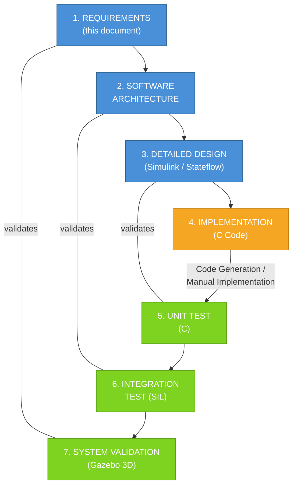

---

## 7. Test Scenarios

### 7.1 Overview

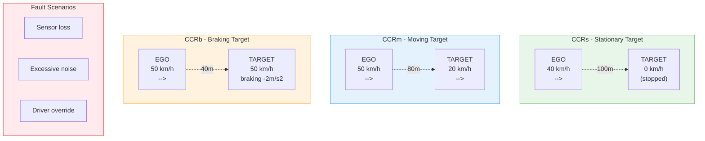

### 7.2 CCRs - Car-to-Car Rear Stationary

| Parameter | Value |
|-----------|-------|
| Ego initial speed | 40 km/h (11.11 m/s) |
| Target speed | 0 km/h (stationary) |
| Initial distance | 100 m |
| Surface | Dry (mu = 0.8) |
| **Pass criterion** | Full stop OR residual velocity < 5 km/h |

### 7.3 CCRm - Car-to-Car Rear Moving

| Parameter | Value |
|-----------|-------|
| Ego initial speed | 50 km/h (13.89 m/s) |
| Target speed | 20 km/h (5.56 m/s) constant |
| Initial distance | 80 m |
| Surface | Dry (mu = 0.8) |
| **Pass criterion** | Collision avoided OR impact speed reduced by >= 20 km/h |

### 7.4 CCRb - Car-to-Car Rear Braking

| Parameter | Value |
|-----------|-------|
| Ego initial speed | 50 km/h (13.89 m/s) |
| Target initial speed | 50 km/h (13.89 m/s) |
| Target deceleration | -2 m/s^2 (starting at t=2s) |
| Initial distance | 40 m |
| Surface | Dry (mu = 0.8) |
| **Pass criterion** | Collision avoided OR impact speed < 15 km/h |

### 7.5 Fault Scenarios (Desirable)

| Scenario | Description | Expected Behavior |
|---------|-----------|-------------------|
| Sensor loss | Sensor returns invalid data during approach | System transitions to OFF, fault alert emitted |
| Excessive noise | Sensor with Gaussian noise sigma=2m | System shall not oscillate between states |
| Driver override | Driver brakes during WARNING phase | System deactivates autonomous braking |

### 7.6 Measured Metrics per Scenario

For each test scenario, the following metrics shall be recorded:

| Metric | Unit | Purpose |
|--------|------|---------|
| Final distance to target at stop | meters | Collision avoidance effectiveness |
| Residual velocity at closest point | km/h | Impact severity reduction |
| Percentage speed reduction | % | Overall AEB performance |
| Time from WARNING to first brake | seconds | UNECE R152 compliance |
| Maximum deceleration achieved | m/s^2 | Comfort and safety limits |
| Maximum jerk | m/s^3 | Drivability assessment |

---

## 8. Risk Analysis

### 8.1 Project Risks

| ID | Risk | Probability | Impact | Mitigation |
|----|------|------------|--------|-----------|
| **R-01** | Gazebo + ROS 2 integration proves too complex for timeline | High | Medium | Gazebo is a differentiator, not a requirement. Fallback: validate 100% in Simulink + SIL in C. |
| **R-02** | Embedded Coder license unavailable or code generation issues | Medium | High | Manual C implementation covers the same requirements. Both paths are acceptable. |
| **R-03** | PID tuning difficult for all 3 braking levels | Medium | Low | Use Simulink PID Tuner for initial gains; fine-tune empirically. Acceptable tolerance is 0.5 m/s^2. |
| **R-04** | ROS 2 + Simulink toolbox compatibility issues | Medium | Medium | Test integration in Week 1 (setup). If fails, decouple Gazebo from Simulink path. |
| **R-05** | Insufficient time for unit test coverage targets | Low | Medium | Prioritize: FSM tests > TTC tests > brake tests > perception tests. |
| **R-06** | Back-to-back test shows divergence > 2.0m | Low | High | Investigate numerical precision. Use same fixed-point/floating-point strategy in both. |

### 8.2 Technical Risks (Safety)

| Hazard | ASIL | Mitigation in Software |
|--------|------|----------------------|
| AEB fails to brake (omission) | ASIL B | Dual-criteria (TTC + d_brake); defensive coding; fault detection |
| AEB brakes without reason (commission) | ASIL B | Plausibility checks; fail-safe = OFF; debounce/hysteresis |
| AEB over-brakes | ASIL A | Deceleration hard limit (-6 m/s^2); jerk limit; PID saturation |
| Sensor data corrupted | ASIL B | Range check; rate-of-change check; 3-cycle timeout |

---

## 9. Traceability Matrix

| Requirement | Simulink Block | C Module | Test Case | Scenario |
|------------|---------------|----------|-----------|----------|
| FR-PER-001..007 | Sensor Model block | `aeb_perception.c` | `test_aeb_perception.c` | All |
| FR-DEC-001..003 | MATLAB Function (TTC) | `aeb_decision_ttc.c` | `test_aeb_ttc.c` | All |
| FR-DEC-004..010 | Stateflow Chart | `aeb_decision_fsm.c` | `test_aeb_fsm.c` | All |
| FR-ALR-001..004 | Stateflow (output actions) | `aeb_decision_fsm.c` | `test_aeb_fsm.c` | All |
| FR-BRK-001..007 | PID Controller block | `aeb_execution_brake.c` | `test_aeb_brake.c` | All |
| FR-FSM-001..005 | Stateflow Chart | `aeb_decision_fsm.c` | `test_aeb_fsm.c` | All |
| FR-COD-001..003 | Embedded Coder | All modules | `test_aeb_integration.c` | All |
| NFR-VAL-001 | Full model simulation | `sil_scenario_ccrs.c` | SIL + Gazebo | CCRs |
| NFR-VAL-002 | Full model simulation | `sil_scenario_ccrm.c` | SIL + Gazebo | CCRm |
| NFR-VAL-003 | Full model simulation | `sil_scenario_ccrb.c` | SIL + Gazebo | CCRb |
| NFR-VAL-007 | Simulink output logs | SIL output logs | Back-to-back comparison | All |

---

## 10. Project Schedule

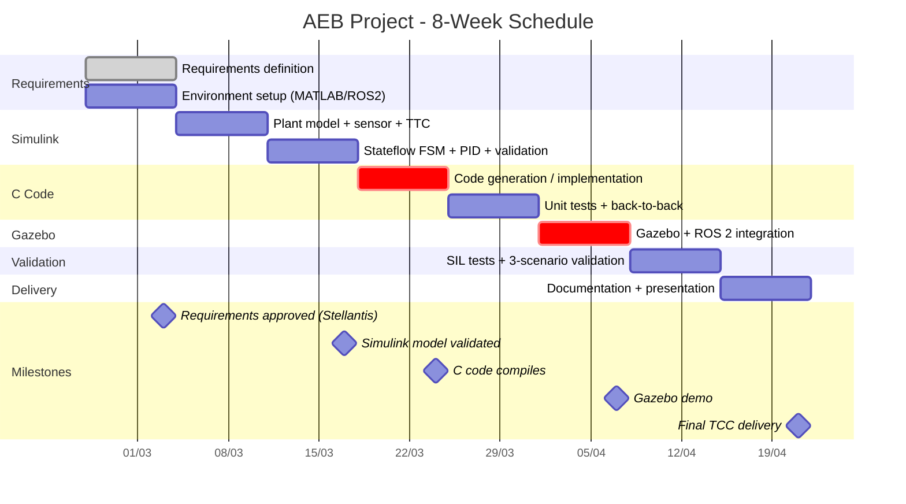

| Week | Main Activity | Deliverable |
|------|-------------|------------|
| **W1** | Requirements finalization (this document). Environment setup: MATLAB/Simulink, ROS 2, Gazebo. Toolbox study. | Approved requirements document. Working environment. |
| **W2** | Simulink modeling: plant model (longitudinal dynamics), idealized sensor, TTC calculation. First offline tests. | Basic Simulink model running CCRs scenario. |
| **W3** | Stateflow implementation: complete FSM. PID brake controller. Offline validation of all 3 scenarios (CCRs, CCRm, CCRb). | Complete Simulink+Stateflow model with validation plots. |
| **W4** | C code generation via Embedded Coder AND/OR manual C implementation of decision logic (FSM + TTC). C project structure. | Compilable C code with modular structure. |
| **W5** | Unit tests (Unity framework or similar). Back-to-back tests (Simulink vs C). | Test suite passing. Coverage report. |
| **W6** | Gazebo integration: 3D world, vehicle model, sensor, ROS 2 communication. CCRs test in 3D. | Gazebo AEB demonstration. |
| **W7** | Complete SIL testing. Validation of all 3 scenarios in C. Results documentation. Parameter fine-tuning. | SIL vs Simulink comparison results. |
| **W8** | Final documentation. Presentation preparation. General review. Buffer for unforeseen issues. | Complete TCC. Presentation ready. |

> **Schedule risk:** Weeks 6 (Gazebo) and 4 (code generation) carry the highest technical risk. If Gazebo proves too complex, the project can be validated 100% in Simulink + SIL in C without losing technical value. Gazebo is a differentiator, not a critical requirement.

---

## 11. Curriculum Mapping

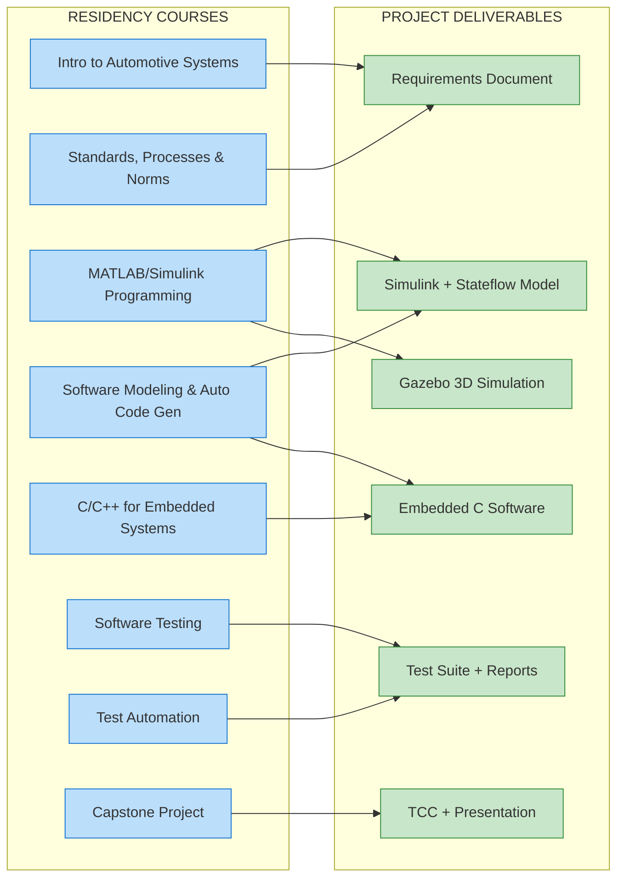

| Course | Application in the Project |
|--------|--------------------------|
| **Intro to Automotive Systems** | Fundamentals: vehicle kinematics, ADAS systems, AEB market context, automotive sensors. |
| **Standards, Processes & Norms** | ISO 26262 (ASIL, V-model), UNECE R152, Euro NCAP, MISRA C. Requirements documentation (this document). |
| **MATLAB/Simulink Programming** | Plant model, TTC calculation, PID controller, scopes, data analysis, scenario scripts. |
| **Software Modeling & Auto Code Generation** | Stateflow (FSM), Embedded Coder (C generation), model-to-code traceability. |
| **C/C++ for Embedded Systems** | Modular C code, MISRA-compliant, fixed-width types, no dynamic allocation, layered architecture. |
| **Software Testing** | Unit tests in C, integration tests, SIL, back-to-back testing. |
| **Test Automation** | Automated scripts to run scenarios, generate reports, verify pass/fail criteria. |
| **Capstone Project** | Integration of all: documentation + implementation + validation + presentation. |

---

## 12. Open Decisions (for Stellantis alignment)

### High Priority (directly impact requirements)
1. **Scenario scope:** Car-to-Car only, or also pedestrians/cyclists? *(Recommendation: Car-to-Car only for 8-week timeline)*
2. **Braking levels:** 2 levels (simplified) or 3 levels (per literature)? *(Recommendation: 3 levels)*
3. **Fixed or adaptive thresholds?** *(Recommendation: fixed with parameterization for future adaptation)*
4. **Primary reference standard:** Euro NCAP + UNECE R152? *(Recommendation: yes)*
5. **Speed operating range:** 10-80 km/h (urban) or 10-130 km/h? *(Recommendation: 10-80 km/h)*

### Medium Priority (impact implementation)
6. **Is Stateflow mandatory?** *(Recommendation: yes, strong academic value)*
7. **Auto-generated code or manual C implementation?** *(Recommendation: both - generate and compare, or generate and refine)*
8. **MISRA C rigor level?** *(Recommendation: mandatory 100%, required with justified deviations)*
9. **Gazebo mandatory or differentiator?** *(Recommendation: desirable differentiator)*

### Low Priority (refinement)
10. **Model fault scenarios (sensor loss, noise)?** *(Recommendation: yes, at least 1 scenario)*
11. **Formal test coverage report?** *(Recommendation: yes, simple)*
12. **Algorithm cycle time 10ms adequate?** *(Recommendation: yes)*

---

## 13. References

### Scientific Articles
1. MDPI Applied Sciences - "AEB mechanism and Simulink/Stateflow modeling." https://www.mdpi.com/2076-3417/13/1/508
2. ScienceDirect - "ECHPN-based AEB modeling and verification." https://www.sciencedirect.com/science/article/pii/S1569190X2500084X
3. ArXiv - "Generating Automotive Code: LLMs for Safety-Critical Systems (ACC)." https://arxiv.org/pdf/2506.04038
4. ArXiv - "Test Case Generation for Drivability Requirements of an Automotive Cruise Controller." https://arxiv.org/pdf/2305.18608
5. ScienceDirect - "Model checking embedded adaptive cruise controllers." https://www.sciencedirect.com/science/article/pii/S0921889023001276
6. Mazda car-following model. https://www.sciencedirect.com/science/article/pii/038943049490216X
7. Honda car-following model. https://www.sciencedirect.com/science/article/pii/038943049594875N

### Standards and Regulations
8. **ISO 26262** - Road vehicles - Functional safety. International Organization for Standardization.
9. **ISO 15622** - Intelligent transport systems - ACC systems. https://www.iso.org/standard/71515.html
10. **ISO 22839** - Forward vehicle collision mitigation systems.
11. **UNECE Regulation No. 152** - AEBS type approval requirements.
12. **Euro NCAP AEB Test Protocol** - European New Car Assessment Programme.
13. **GB/T 33577-2017** - Chinese AEB highway standard (referenced in MDPI article).
14. **GB/T 38186-2019** - Chinese AEB performance requirements.
15. **MISRA C:2012** - Guidelines for the use of C in critical systems. MISRA Ltd.

### Tools and Platforms
16. MathWorks Simulink - Model-Based Design. https://www.mathworks.com/products/simulink.html
17. MathWorks Stateflow - State Machine Design. https://www.mathworks.com/products/stateflow.html
18. MathWorks Embedded Coder - Code generation. https://www.mathworks.com/products/embedded-coder.html
19. Gazebo - Robot simulation. https://gazebosim.org/
20. ROS 2 - Robot Operating System. https://docs.ros.org/

---

*This document serves as the basis for discussion and approval. All numerical values (TTC thresholds, decelerations, timing) are based on literature and can be adjusted per Stellantis guidance.*
