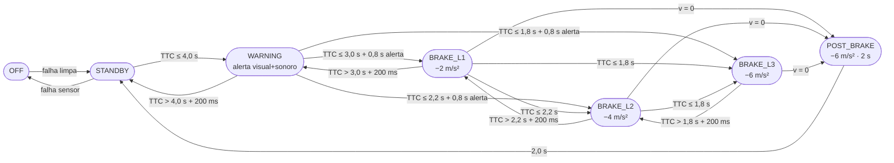

# **Autonomous Emergency Braking (AEB)**  

> Technological Residency in Embedded Software Development for the Automotive Sector  
> Federal University of Pernambuco (UFPE) · Center for Informatics · Stellantis


---

## Overview

This repository contains the requirements baseline, model-based design artefacts, software implementation assets, and configuration-management workflow for an **Autonomous Emergency Braking (AEB)** system focused on **rear-end collision mitigation**.

The system is designed to detect imminent rear-end collision risk with a vehicle ahead, warn the driver, and autonomously apply progressive braking when required to avoid or mitigate impact severity.

The current project baseline is limited to **longitudinal control only**. No lateral collision-avoidance manoeuvres, such as steering interventions, are included.

---

## Project Scope

The AEB baseline documented in this repository is defined by the following characteristics:

- rear-end collision mitigation against a vehicle ahead
- operation in the **10–60 km/h** ego-vehicle speed range
- dual decision criterion based on **Time-To-Collision (TTC)** and **minimum braking distance**
- progressive intervention through a **7-state Finite State Machine**
- communication support through **CAN**
- diagnostic support through **UDS**
- traceability from **requirements → model → C implementation → Tests**

### In Scope

- **CCRs** — Car-to-Car Rear Stationary
- **CCRm** — Car-to-Car Rear Moving
- **CCRb** — Car-to-Car Rear Braking
- requirements engineering and traceability
- MIL-oriented model validation
- embedded C implementation aligned with the validated design baseline
- software quality constraints derived from MISRA C and ISO 26262-oriented practices

### Out of Scope

- vulnerable road users (pedestrians, cyclists)
- lateral collision avoidance
- production ECU electrical integration
- real sensor-fusion deployment
- adverse weather and complex road geometries beyond straight longitudinal scenarios

---

## Operational States

The validated AEB state machine contains seven states:

1. **OFF**
2. **STANDBY**
3. **WARNING**
4. **BRAKE_L1**
5. **BRAKE_L2**
6. **BRAKE_L3**
7. **POST_BRAKE**



**Floor distance** (prevent premature de-climbing while braking):
- d ≤ 20 m → maintain minimum BRAKE_L1
- d ≤ 10 m → maintain minimum BRAKE_L2
- d ≤ 5 m → maintain minimum BRAKE_L3

---

### Intervention semantics

- **WARNING** provides prior driver notification
- **BRAKE_L1 / L2 / L3** represent progressively stronger autonomous braking
- **POST_BRAKE** maintains brake hold after vehicle stop and manages post-stop release

---

## Validation Scenarios (Euro NCAP CCR)

The requirements baseline defines representative validation scenarios and acceptance criteria:

| Scenario | Condition | Acceptance Criterion |
|---|---|---|
| **CCRs** | Ego vehicle at 40 km/h, stationary target | Complete stop or residual speed < 5 km/h |
| **CCRm** | Ego vehicle at 50 km/h, target at 20 km/h | Collision avoided or impact speed reduced by at least 20 km/h |
| **CCRb** | Ego vehicle at 50 km/h, target decelerating at −2 m/s² | Collision avoided or impact speed < 15 km/h |

In all validated scenarios, the project monitors final distance, residual speed, braking behaviour, and state transitions.

---

## Architecture

The repository follows the classic **three-layer ADAS architecture**, in which perception provides validated input data, decision logic evaluates collision risk, and execution applies alerts and braking actions. In addition, **CAN** and **UDS** support communication and diagnostic functions across the system.

| Block | Input | Processing | Output |
|---|---|---|---|
| **Perception** | Distance, ego speed, target speed, fault indicators | Validation, plausibility checks, signal conditioning | Trusted signals |
| **Decision** | Trusted signals, override inputs | TTC, braking-floor logic, FSM transitions, risk assessment | Alert/braking request |
| **Execution** | Alert/braking request | Alert generation and brake control | Brake command, alert output |
| **CAN** | System signals | Communication transport and timeout handling | Encoded/decoded messages |
| **UDS** | Diagnostic requests | Data access, DTC handling, enable/disable routines | Diagnostic responses |
---

## Software Decomposition

The requirements-to-software traceability baseline maps the main functional domains to the following implementation modules:

| Module | Responsibility |
|---|---|
| `aeb_perception.c` | sensor acquisition and validation |
| `aeb_ttc.c` | TTC and braking-distance calculation |
| `aeb_fsm.c` | risk classification, distance floors, and state-machine control |
| `aeb_alert.c` | visual and audible alert outputs |
| `aeb_pid.c` | braking control and brake-command generation |
| `aeb_can.c` | CAN encoding, decoding, and timeout handling |
| `aeb_uds.c` | UDS diagnostic services |

This modular structure supports portability, maintainability, and bidirectional traceability.

---
## Compliance and Standards

| Aspect | Standard | Status |
|---|---|---|
| Embedded C code | MISRA C:2012 | ✅ Implemented |
| Functional safety | ISO 26262 ASIL-B | ✅ Compliant architecture |
| Test scenarios | Euro NCAP AEB CCR v4.3 | ✅ CCRs, CCRm, CCRb |
| AEB protocol | UNECE R152 | ✅ Alert ≥ 0.8 s before braking |
| CAN bus | Proprietary DBC file | ✅ 5 structured frames |
| Sensor fusion | ISO 15622 | ✅ Weighted radar + lidar |

---
## Authors
- Eryca Francyele de Moura e Silva
- Jéssica Roberta de Souza Santos
- Lourenço Jamba Mphili
- Renato Silva Fagundes
- Rian Ithalo da Costa Linhares

## Repository Contents

The repository is organized to keep requirements, modeling artefacts, software implementation, simulation assets, and validation evidence under version control.

```text
.
├── .github/                          # GitHub configuration
│   ├── pull_request_template.md      # Default pull request template
│   └── workflows/                    # CI workflows and automation
├── docs/                             # Project documentation
│   ├── requirements/                 # Software requirements specification and traceability artefacts
│   ├── modeling/                     # MIL modeling documentation and subsystem traceability
│   ├── tests/                        # Test strategy, validation evidence, and reports
│   └── scm/                          # Configuration management documentation
├── modeling/                         # Main modeling workspace
│   ├── c_embedded/                   # Embedded C implementation baseline
│   │   ├── include/                  # Header files and public interfaces
│   │   │   ├── aeb_config.h          # Calibratable parameters and system constants
│   │   │   ├── aeb_types.h           # Shared data types and structures
│   │   │   └── aeb_*.h               # Interfaces for AEB software modules
│   │   ├── src/                      # C source files
│   │   │   ├── aeb_main.c            # 10 ms control-cycle orchestration
│   │   │   ├── aeb_fsm.c             # 7-state finite state machine
│   │   │   ├── aeb_ttc.c             # TTC and braking-distance calculations
│   │   │   ├── aeb_perception.c      # Input validation and fault handling
│   │   │   ├── aeb_pid.c             # Braking-control logic
│   │   │   └── aeb_alert.c           # Driver alert generation
│   │   └── test/                     # Unit-test sources for embedded modules
│   │       └── test_aeb.c            # Unit-test entry point / test harness
│   ├── AEB_Controller.slx            # Controller model
│   ├── AEB_Perception.slx            # Perception model
│   ├── AEB_CAN.slx                   # CAN communication model
│   ├── AEB_UDS.slx                   # UDS diagnostics model
│   ├── AEB_Plant.slx                 # Vehicle / actuator plant model
│   └── AEB_Integration.slx           # Closed-loop integration model
├── gazebo_sim/                       # Simulation-oriented environment
│   └── aeb_gazebo/                   # ROS2 / Gazebo package
│       ├── src/                      # Simulation and integration nodes
│       │   ├── aeb_controller_node.cpp
│       │   ├── perception_node.py
│       │   ├── scenario_controller.py
│       │   └── dashboard_node.py
│       ├── msg/                      # Structured ROS2 messages aligned with CAN concepts
│       ├── launch/                   # Launch files for scenario execution
│       ├── worlds/                   # Gazebo worlds
│       ├── models/                   # 3D vehicle and environment models
│       └── run.sh                    # Quick execution script
├── Dockerfile                        # Reproducible development environment
├── docker-compose.yml                # Optional local orchestration
├── README.md                         # Repository overview
└── CHANGELOG.md                      # Version and release history
